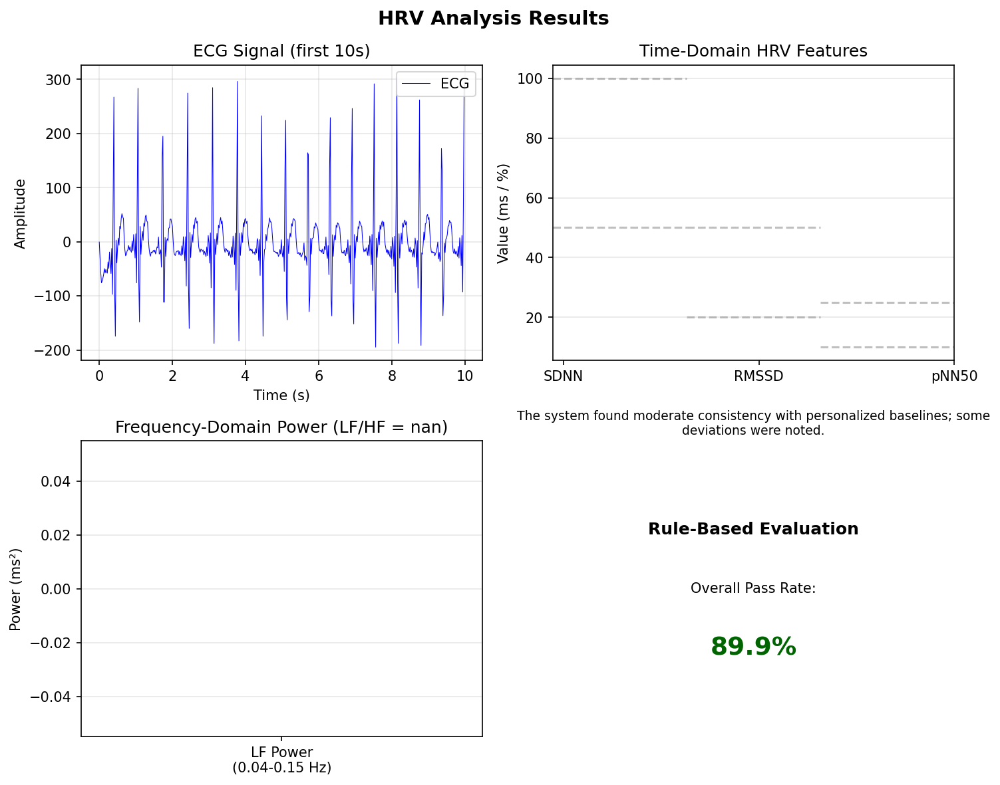

# HRV Analysis Report

**Generated:** 2026-01-24 17:03:22

## 1. HRV Features Summary

| Metric      | Value           | Normal Range |
|-------------|-----------------|--------------|
| SDNN (ms)   | nan    | 50-100       |
| RMSSD (ms)  | nan   | 20-50        |
| pNN50 (%)   | nan    | 10-25        |
| Mean HR (bpm)| nan | 60-100       |
| LF/HF Ratio | nan | 1.0-2.0      |

## 2. Evaluation Summary

**Overall Pass Rate:** 89.9%
**Summary:** The system found moderate consistency with personalized baselines; some deviations were noted.

## 3. Visualizations

## 4. Discussion

AI interpretation not requested.

## 5. Conclusion

Please review the HRV metrics above.
